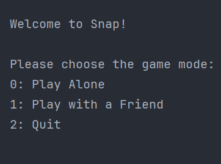
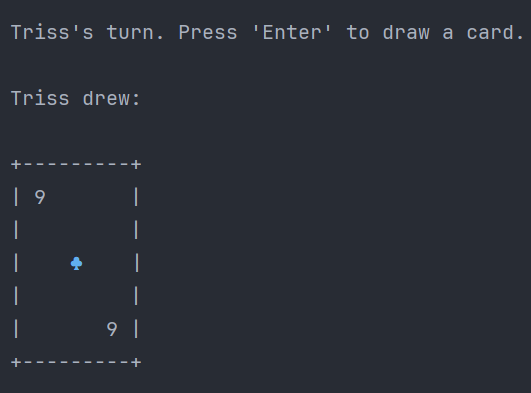

# Snap Game

## Overview

This project features a console-based Snap card game implemented in Java. It delivers an interactive and fast-paced gaming experience, allowing players to enjoy the classic game of Snap either solo or with a friend.

## Features

- **Interactive Gameplay**: Engages players in a traditional card game of Snap through the console.
- **Single and Dual Player Modes**: Offers the option to play alone or compete against a friend.
- **Dynamic Card Shuffling**: Randomises the deck each game for an unpredictable playthrough.
- **Instant Win Detection**: Automatically detects a "snap" condition and declares the winner.

  &nbsp;&nbsp;&nbsp;&nbsp;
  

## How to Run

Ensure Java is installed on your system to play the Snap game:

1. Compile the project with your preferred development tools.
2. Run the `Main` class within the `snap` package to start the game.

## Gameplay

1. Players start by selecting a game mode: single-player or two-player.
2. In each turn, a player draws a card by pressing 'Enter'.
3. The game continues until a player wins by catching a snap or the deck runs out of cards.

## Future Enhancements

- **Unit Testing**: Implement unit tests for robust validation and future-proofing.
- **Snap Timer**: Add a 2-second timer for players to declare "snap" and intensify gameplay.
- **Score Tracking**: Create a system to track and display player scores.

## Contact

For any additional questions or comments, feel free to reach out to me directly through the contact information provided
on my GitHub page.